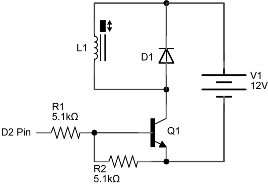

# Dora Timer

IT 界隈での LT(ライトニングトーク)用に、自動でドラを鳴らす装置を制作しました。  
ブラウザとMIDIデバイス化したArduinoをWeb MIDI APIを利用して接続し、Webアプリからソレノイド他を直接操作しています。

## Feature
- 表示＆コントロールはブラウザで
- ArduinoをMIDIデバイス化して、
- PC/Androidと接続時間になったらドラを鳴らす

## Sample
### Basic Version
指定時間経過後、Web MIDI APIを経由してArudinoに信号を送り、ソレノイドを動作させる最小の構成です。
https://ktknest.github.io/dora-timer/basic

### App Version
Arduino側からのON/OFF操作や、Webアプリケーション上での停止、リセット、残り時間設定などを加えた構成です。
https://ktknest.github.io/dora-timer/app

## Parts list

|パーツ|数量|備考|
|:--|:--|:--|
|Arduino UNO|1|MIDIデバイス化して使用|
|プッシュソレノイド（新電元 S-1212）|1|12Vで動作|
|ダイオード（IN4004）|1|ソレノイドの逆電圧対策|
|抵抗（5.1kΩ）|2|
|ジャンパピン|1|Arduinoの切り替え|
|ユニバーサル基板、線材など|-||
|PC|1|最新のChrome（43+）をインストール|
|USBケーブル|1|Arduino接続用（A-Bタイプ）|
|ドラ|1|アウトドア用の鍋で代用|
|バチ（シャフト、ジョイント）|1|ソレノイドと接続|
|筐体|-|木材などで組み立て|

## Circuit diagram

## FYI
- http://morecatlab.akiba.coocan.jp/lab/index.php/aruino/midi-firmware-for-arduino-uno-moco/
- http://www.dm9records.com/index.php/tips/arduino/moco/
- http://qiita.com/tadfmac/items/9136f47ae1eea99a4ef7

## License
The MIT License (MIT)
